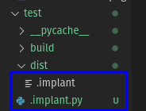

# Operation Static Analytics - Preparation
****************************************************************
# Communication Plans

The diagram below shows the plan as to how communications will be handled between C2 and implant(s)

# Initial C2 Server Set-Up

## Choosing a VPS provider

### VPS - Factors to Consider

There are a number of factors to consider when choosing a VPS provider for this operation:
* Security: VPS should be on secure infrastructure. 
* Availability: VPS should have a relatively high uptime
* Location: Preferably the provider is located in a country outside of the [14 eyes](https://restoreprivacy.com/5-eyes-9-eyes-14-eyes/). But anything outside of the 9 eyes will be deemed acceptable.
* Performance: Performance expectations are not high, but should be sufficient for a staging server, an ssh connection, and managing multiple scripts and API calls. 
* **Privacy:** There should be the option to have no linking of personal information between operators and the server.
* Cost: Unfortunately this rules out a decent number of options that meet at least most of the requirements above. While mid-range cost is an option, I do not want to pay upward of $100-200 per month for this server. 
* Ethics: The VPS provider should be willing to be the VPS provider and not a compromised "VPS" "provider" (aka botnet). We're the good guys here... I think. I also don't want to go to jail : ) 

### VPS - A Decision Made

While VPS service providers such as Linode and AWS are readily available and affordable, I am not comfortable in disclosing personal information online for as much as possible. As such, [Njalla](https://njal.la/) [(Alternative onion link)](http://njallalafimoej5i4eg7vlnqjvmb6zhdh27qxcatdn647jtwwwui3nad.onion/) was the chosen VPS provider. Despite being moderately costly, it easily is one of the most privacy oriented VPS providers while also remaining under the 40€ price range for decent hardware. Only an email was required for an account, and crypto payment is an option (I used Monero for that sweet anonymity). While it is based in Sweden, which is part of the 14 eyes, Njalla has a good track record at denying governments' grubby grips for the goods. 

Information regarding the server specs and setup can be found below. 

For 30€, the specs are decent, and the privacy is well worth it. Not a single bit of identifying information was used when purchasing the VPS, even in payment. 

### VPS - Setup

#### VPS - Initial setup

Setting up the server was simple, during purchase the OS was selected (in this case Ubuntu 20.04 as it's what I'm most familiar with), and a public ssh-key was generated and given to the server for authorizing my access. [How to generate a ssh key pair](https://njal.la/docs/create-sshkey/) [(Alternative onion link)](http://njallalafimoej5i4eg7vlnqjvmb6zhdh27qxcatdn647jtwwwui3nad.onion/docs/create-sshkey/)

#### VPS - Torified SSH 

Only doing this guide specifically for a linux build

1. Grab tor with apt or the equivalent `sudo apt-get install tor -y`
2. Configure tor for ssh
   1. `echo "HiddenServiceDir /var/lib/tor/other_hidden_service/" >> /var/lib/tor/other_hidden_service/`
   2. `echo "HiddenServicePort 2 /var/lib/tor/other_hidden_service/" >> /var/lib/tor/other_hidden_service/`
3. Restart tor with `sudo systemctl restart tor`
4. (Optional) If a host name is needed for your VPS, get your hostname with `sudo cat /var/lib/tor/other_hidden_service/hostname`
5. Tor is now configured for ssh

To use it just run your typical ssh connection but preempt it with with torify: 
`torify ssh root@MY.C2.SERVER.IP`

This will prevent your IP from ever being logged in /var/log/auth.log. 

For example:
My (redacted) IP is shown below, 

but when I ssh into the server it's a different torified IP

This greatly helps in distancing operators from the C2 server at the cost of some speed for the SSH connection; however, the small speed loss is worth the gain in OPSEC. 
***************
# C2 Commands and Scripts
* Mostly done through macros
* Done to not have to manually edit story/post gists by hand
  
## Generating the Story
Core script for functionality: [story-gen.py](cc/src/story-gen.py)

Multiple commands types can be embedded within the same story. For example, a shell and a cmd command can be sent. This is because all of the information for each of the commands are available at various parts throughout the story rather than in one location. 

To reduce the chances of being decoded, anything that is not an active command randomly generates values that may be similar to the value that may be present during the command. In addition, there are a number of other factors in the story which are randomly generated to add more entropy, making it hard to tell what is and isn't relevant.

Example of generating a story for running the command located in a pastebin (at V80fDq3S) and trying to make a reverse shell connection at 10.92.57.28:300.

And an example of only given the name:

Of course these can be saved into a file by redirecting output with `>`

## Posting the Central Gists
Core script for functionality: [postGist.py](/cc/src/postGist.py)

This needs to be done before the implant is deployed, as the initial central gist will be coded within the implant.

In practice, this will be done on separate account.

It can simply be done by naming the file within the repository.

As I'm writing I currently have 0 gists posted on my main account:

However, after running the postGist.py script we can make a central gist for the implants.

Checking the gists, there is now one with the file we uploaded!

## Editing Gists
Core script for functionality: [editGist.py](cc/src/editGist.py)

Gists can be editted to include multiple files and to change the files currently uploaded to the gist. This allows for multiple implants to share the same central gist as well as to update each implant individually. 

To demonstrate, we'll generate two new stories

And edit the gist with the script to post/edit the stories

And now it can be seen that there are two stories, with Eldenwyre's being editted.

## Hosting the listener shell
Core script for functionality: [listener.py](cc/src/listener.py)

******************************

# Implant Commands and Design

Aside from adding itself as a cron task, it can do the following commands upon request. Most commands work cross platform as they're pure python, however some have diminished success such as the info macro. Primarily targets linux, can be adapted to other platforms with minor tweaks. 

## Info Macro
Detailed by the word "scarlet" in the story
Returns some useful information about the system
Sends info to the burner email 

> "{"scarlet": ["Linux", "fail-not", "5.11.0-7612-generic", "#13~1617215757~20.10~97a8d1a-Ubuntu SMP Thu Apr 1 21:09:17 UTC 2", "x86_64", "x86_64"]}"

## Command Execution and File Exfiltration

Capable of extracting information from the base-64 encoded pastebins detailed in the story. Note: there are separate pastebins for the command execution and file exfiltration. For instance, this grabbed the image from the repo from earlier and executed a few useful commands. 

>{"marketplace": "total 48\ndrwxrwxr-x 5 miles miles 4096 Apr 29 05:39 .\ndrwxrwxr-x 9 miles miles 4096 Apr 29 03:55 ..\ndrwxrwxr-x 4 miles miles 4096 Apr 29 03:55 build\ndrwxrwxr-x 2 miles miles 4096 Apr 29 05:16 dist\n-rw-rw-r-- 1 miles miles 1097 Apr 29 05:07 e-mail.py\n-rw-rw-r-- 1 miles miles 7027 Apr 29 05:35 .implant.py\n-rw-rw-r-- 1 miles miles 7086 Apr 29 05:48 implant.py\n-rw-rw-r-- 1 miles miles  885 Apr 29 05:16 implant.spec\ndrwxrwxr-x 2 miles miles 4096 Apr 29 05:16 pycache\n-rw-rw-r-- 1 miles miles  879 Apr 29 03:55 test.spec\n/home/miles/coding/school/cs4001/scaling-guacamole/test\nhello\n", "Max Ter'Forg'r": "/home/miles/coding/school/cs4001/scaling-guacamole/screenshots/myip.png"}

## Evasion by Hiding
Will move itself to be hidden by renaming its file into .FILE
Does this regardless of location and regardless of if it is a built script using something like pyinstaller or a loose pyscript.

Before:

After:

## Self-Destruction
Implant is capable of self destructing upon receiving "french-bread". It is deathly allergic. Will remove itself and kill its own process.

